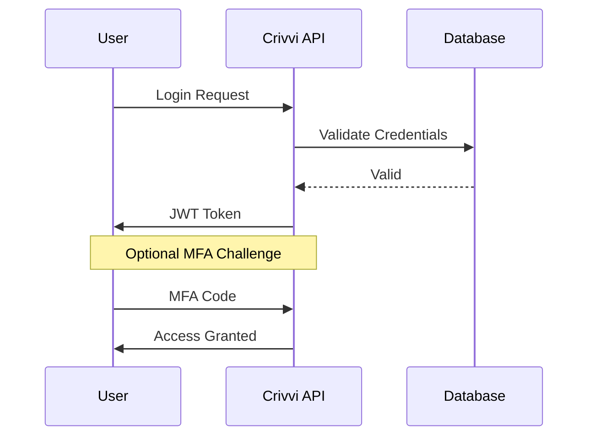

## Overview

Crivvi provides robust authentication to protect your shared secrets and files. You authenticate via multiple methods, assign roles with granular permissions, enable multi-factor authentication (MFA), and revoke access instantly. This ensures zero-knowledge security for teams exchanging sensitive data.

<Columns cols={3}>
  <Card title="Login Methods" icon="log-in" href="#login-methods">
    Choose from email, SSO, or API keys.
  </Card>
  <Card title="User Roles" icon="users" href="#user-roles">
    Manage admin, editor, and viewer permissions.
  </Card>
  <Card title="MFA Setup" icon="shield" href="#mfa">
    Add an extra security layer.
  </Card>
</Columns>

## Login Methods

Crivvi supports flexible login options. Use the method that fits your workflow.

<Tabs>
  <Tab title="Email/Password" icon="mail">
    Enter your credentials on the login page.
    
    ```javascript
    // Example login request
    const response = await fetch('https://api.crivvi.com/auth/login', {
      method: 'POST',
      headers: { 'Content-Type': 'application/json' },
      body: JSON.stringify({
        email: 'user@company.com',
        password: 'securepass123'
      })
    });
    ```
  </Tab>
  <Tab title="Single Sign-On (SSO)" icon="globe">
    Configure SAML or OAuth with providers like Okta or Google Workspace.
    
    <Callout kind="tip">
      Contact support to enable SSO for your organization.
    </Callout>
  </Tab>
  <Tab title="API Keys" icon="key">
    Generate keys from your dashboard for programmatic access.
    
    <ParamField header="X-API-Key" param-type="string" required="true">
      Your secret API key (keep it secure).
    </ParamField>
  </Tab>
</Tabs>

## User Roles and Permissions

Assign roles to control what users can do. Admins manage everything, editors share secrets, and viewers read-only.

| Role     | Create Shares | View Secrets | Manage Users | Delete Data |
|----------|---------------|--------------|--------------|-------------|
| Admin    | ✅            | ✅           | ✅           | ✅          |
| Editor   | ✅            | ✅           | ❌           | ❌          |
| Viewer   | ❌            | ✅           | ❌           | ❌          |

<Request tabs="JavaScript,cURL" show-lines="true">
  ```javascript
  // Assign role via API
  await fetch('https://api.crivvi.com/users/123/role', {
    method: 'PATCH',
    headers: {
      'Authorization': 'Bearer your_jwt_token',
      'Content-Type': 'application/json'
    },
    body: JSON.stringify({ role: 'editor' })
  });
  ```
  ```bash
  curl -X PATCH https://api.crivvi.com/users/123/role \
    -H "Authorization: Bearer your_jwt_token" \
    -H "Content-Type: application/json" \
    -d '{"role": "editor"}'
  ```
</Request>

<Response tabs="200">
  ```json
  {
    "user_id": "123",
    "role": "editor",
    "updated_at": "2024-10-15T10:30:00Z"
  }
  ```
</Response>

## Multi-factor Authentication

Enable MFA to require a second verification step. You use authenticator apps like Authy or Google Authenticator.

<Steps>
  <Step title="Enable MFA" icon="settings">
    Go to Account Settings > Security > MFA.
    
    Scan the QR code with your app.
  </Step>
  <Step title="Verify Setup" icon="check-circle">
    Enter the 6-digit code from your app.
  </Step>
  <Step title="Save Backup Codes" icon="download">
    Download and store 10 one-time codes securely.
  </Step>
</Steps>

<Callout kind="warning">
  Never share your MFA codes or backup codes. Revoke them if compromised.
</Callout>

## Access Revocation

Revoke access immediately for offboarding or security incidents.

<ExpandableGroup>
  <Expandable title="Revoke User Access" default-open="true">
    1. Navigate to Team > Members.
    2. Select the user and click Revoke.
    
    All shares and logins become invalid instantly.
  </Expandable>
  <Expandable title="Rotate API Keys">
    Generate a new key and update your integrations. Old keys expire in 5 minutes.
  </Expandable>
</ExpandableGroup>

## Advanced Authentication Flows



<CodeGroup tabs="Node.js,Python">
  ```javascript
  // JWT token validation (Node.js)
  const jwt = require('jsonwebtoken');
  const token = req.headers.authorization.split(' ')[1];
  const decoded = jwt.verify(token, process.env.JWT_SECRET);
  ```
  ```python
  # JWT token validation (Python)
  import jwt
  token = request.headers['Authorization'].split()[1]
  decoded = jwt.decode(token, 'your-secret', algorithms=['HS256'])
  ```
</CodeGroup>

Secure your Crivvi instance by combining these features. Regularly review access logs in the dashboard.