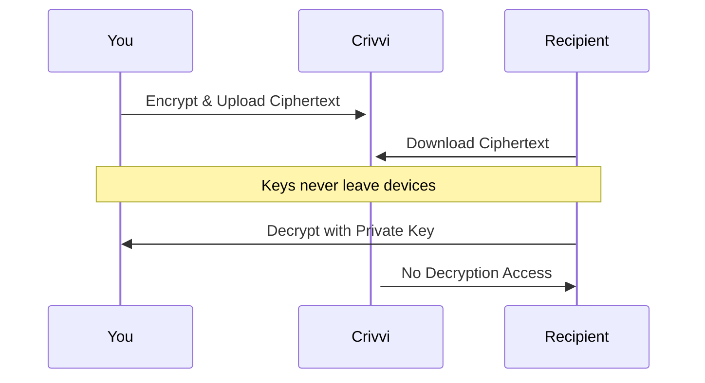
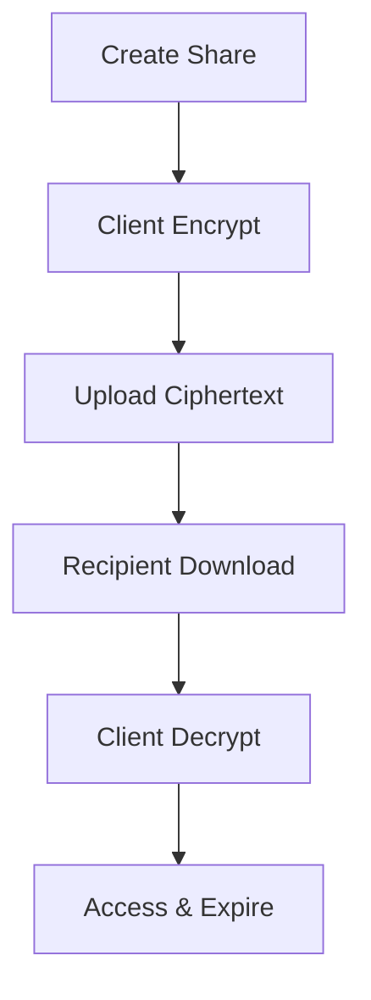

## Overview

Crivvi provides a secure platform for teams to share sensitive information like passwords, files, and secrets. You benefit from zero-knowledge encryption, meaning only recipients access the data. Core concepts ensure safe, reliable credential management.

<Callout kind="info">
  Crivvi never stores your unencrypted data. Review these principles before sharing.
</Callout>

## Zero-Knowledge Encryption

Zero-knowledge encryption proves Crivvi handles data without accessing plaintext. You encrypt content client-side with recipient-specific keys. The platform stores only ciphertext.

This approach uses end-to-end encryption (E2EE). When you share, recipients decrypt using private keys.



## Sharing Types

Crivvi supports multiple sharing formats tailored to your needs.

<Columns cols={3}>
  <Card title="Passwords" icon="lock" href="#">
    Share credentials securely with expiration and access limits.
  </Card>
  <Card title="Files" icon="file" href="#">
    Encrypt and transmit documents up to 500MB.
  </Card>
  <Card title="Secrets" icon="key" href="#">
    Manage API keys, tokens, and ephemeral data.
  </Card>
</Columns>

## Data Lifecycle

Understand how data flows through Crivvi:



1. You create and encrypt.
2. Platform stores ciphertext.
3. Recipient downloads and decrypts.
4. Data auto-expires.

## Security Best Practices

Follow these steps to maximize protection.

<Steps>
  <Step title="Generate Strong Keys" icon="key">
    Use Crivvi's SDK to create 256-bit keys.

    <CodeGroup tabs="JavaScript,Python">
      ```javascript
      import { generateKeyPair } from '@crivvi/sdk';
      const { publicKey, privateKey } = await generateKeyPair();
      ```
      ```python
      from crivvi import generate_keypair
      public_key, private_key = generate_keypair()
      ```
    </CodeGroup>
  </Step>
  <Step title="Set Expirations" icon="clock">
    Always define TTL for shares, e.g., 24 hours.
  </Step>
  <Step title="Verify Recipients" icon="shield">
    Use multi-factor authentication before sharing.
  </Step>
</Steps>

<Tabs>
  <Tab title="Password Sharing" icon="lock">
    Share a database credential:

    ```javascript
    const share = await crivvi.sharePassword({
      password: 'supersecret123',
      recipientEmail: 'team@company.com',
      expiresIn: '24h'
    });
    console.log(`Share link: ${share.url}`);
    ```
  </Tab>
  <Tab title="File Sharing" icon="file">
    Upload an encrypted config file:

    ```javascript
    const fileShare = await crivvi.shareFile({
      file: encryptedBuffer,
      filename: 'config.json',
      recipients: ['user1@company.com', 'user2@company.com']
    });
    ```
  </Tab>
</Tabs>

<Expandable title="Advanced: Key Rotation" default-open="false">
  Rotate keys periodically for long-lived shares. Use the SDK's `rotateKeys` method to update without downtime.
</Expandable>

Adopt these concepts to leverage Crivvi's full security potential.